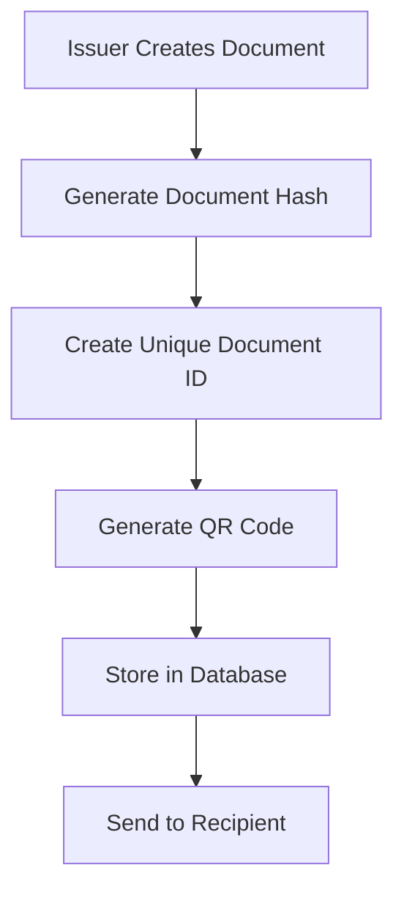
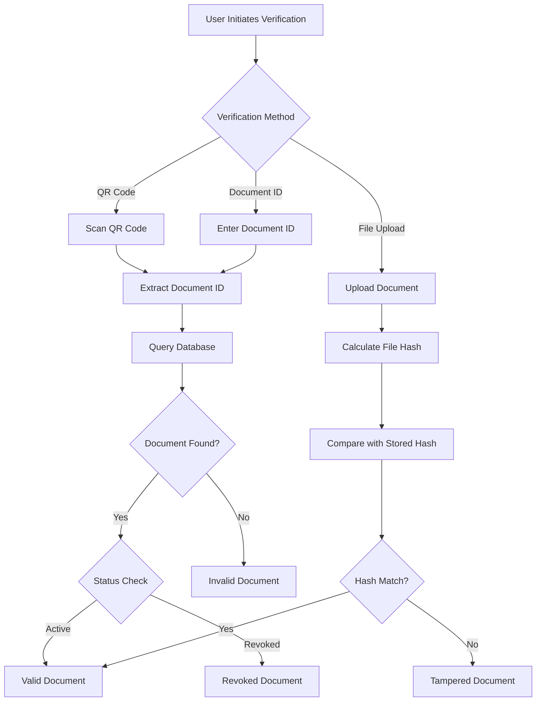

# LegitCheck - Document Verification Platform

A comprehensive document verification system designed to combat fraud in healthcare and education sectors. LegitCheck provides secure document issuance, verification, and management through both web and mobile applications.

## 🚀 Overview

LegitCheck is a full-stack document verification platform that enables:
- **Secure Document Issuance**: Healthcare and educational institutions can issue tamper-proof digital documents
- **Instant Verification**: Anyone can verify document authenticity through QR codes, file uploads, or document IDs
- **Fraud Prevention**: Advanced cryptographic hashing and blockchain-inspired verification prevents document forgery
- **Multi-Platform Access**: Available as both web application and mobile app for maximum accessibility

## 🏗️ Architecture

The platform consists of three main components:

### 1. Web Application (React + TypeScript)
- **Frontend**: Modern React application with TypeScript and Tailwind CSS
- **Authentication**: Firebase Authentication with role-based access control
- **Database**: Cloud Firestore for real-time data synchronization
- **Storage**: Firebase Storage for document files
- **Hosting**: Optimized for deployment on Firebase Hosting or Vercel

### 2. Mobile Application (React Native + Expo)
- **Cross-Platform**: Single codebase for iOS and Android
- **QR Scanning**: Native camera integration for instant document verification
- **Offline Support**: Core verification functionality works with cached data
- **Real-time Sync**: Seamless integration with the web platform's database

### 3. Backend Services (Firebase)
- **Authentication**: Secure user management with role-based permissions
- **Database**: Cloud Firestore with security rules
- **Storage**: Encrypted document storage
- **Analytics**: Usage tracking and verification logs

## 🎯 Key Features

### For Document Issuers
- **Organization Registration**: Healthcare and educational institutions can register and get verified
- **Document Creation**: Issue certificates, medical reports, transcripts, and other official documents
- **QR Code Generation**: Automatic QR code creation for each document
- **Document Management**: View, edit, and revoke issued documents
- **Analytics Dashboard**: Track document usage and verification statistics

### For Verifiers
- **Multiple Verification Methods**:
  - QR Code scanning (mobile and web)
  - File upload verification
  - Direct document ID lookup
- **Instant Results**: Real-time verification with detailed document information
- **Verification History**: Complete audit trail of all verification attempts
- **Public Access**: No registration required for document verification

### For Administrators
- **Issuer Management**: Approve or reject organization registration requests
- **System Monitoring**: Overview of platform usage and statistics
- **Security Controls**: Manage user roles and permissions
- **Audit Logs**: Complete system activity tracking

## 🛠️ Technology Stack

### Frontend (Web)
- **React 18** - Modern UI library with hooks and concurrent features
- **TypeScript** - Type-safe development
- **Tailwind CSS** - Utility-first CSS framework
- **React Router** - Client-side routing
- **Lucide React** - Beautiful icon library
- **Vite** - Fast build tool and development server

### Frontend (Mobile)
- **React Native** - Cross-platform mobile development
- **Expo** - Development platform and tools
- **TypeScript** - Type safety for mobile development
- **Expo Camera** - Native camera integration
- **Expo Barcode Scanner** - QR code scanning capabilities

### Backend & Services
- **Firebase Authentication** - User management and security
- **Cloud Firestore** - NoSQL document database
- **Firebase Storage** - File storage and CDN
- **Firebase Hosting** - Web application hosting
- **Firebase Analytics** - Usage tracking and insights

### Security & Cryptography
- **CryptoJS** - Document hashing and encryption
- **SHA-256** - Cryptographic hash function for document integrity
- **Firebase Security Rules** - Database-level access control
- **Role-based Access Control** - Multi-tier permission system

### Development Tools
- **ESLint** - Code linting and quality
- **PostCSS** - CSS processing
- **Autoprefixer** - CSS vendor prefixing
- **npm/yarn** - Package management

## 📱 Applications

### Web Application Features
- **Responsive Design**: Works seamlessly on desktop, tablet, and mobile browsers
- **Progressive Web App**: Can be installed on devices for native-like experience
- **Real-time Updates**: Live synchronization of data across all connected clients
- **Advanced UI**: Modern, accessible interface with dark/light theme support

### Mobile Application Features
- **Native Performance**: Optimized for mobile devices with smooth animations
- **Camera Integration**: Direct access to device camera for QR scanning
- **Offline Capability**: Core verification works without internet connection
- **Push Notifications**: Real-time alerts for important updates (future feature)

## 🔐 Security Features

### Document Security
- **Cryptographic Hashing**: Each document gets a unique SHA-256 hash
- **Tamper Detection**: Any modification to document content is immediately detectable
- **Unique Document IDs**: Timestamped, random IDs prevent duplication
- **Revocation System**: Documents can be revoked with audit trail

### User Security
- **Firebase Authentication**: Industry-standard user authentication
- **Role-based Access**: Granular permissions for different user types
- **Secure API**: All database operations protected by security rules
- **Audit Logging**: Complete tracking of all system activities

### Data Protection
- **Encrypted Storage**: All documents encrypted at rest
- **Secure Transmission**: HTTPS/TLS for all data transfer
- **Privacy Controls**: Users control their data visibility
- **GDPR Compliance**: Built with privacy regulations in mind

## 🚦 User Roles & Permissions

### Public Users (No Registration Required)
- ✅ Verify documents through any method
- ✅ View verification results
- ✅ Access public verification interface
- ❌ Cannot issue or manage documents

### Issuer Users (Registered Organizations)
- ✅ All public user capabilities
- ✅ Issue new documents
- ✅ Manage issued documents
- ✅ View organization analytics
- ✅ Revoke documents with reason
- ❌ Cannot approve other issuers

### Admin Users (Platform Administrators)
- ✅ All issuer capabilities
- ✅ Approve/reject issuer applications
- ✅ View system-wide analytics
- ✅ Manage user roles
- ✅ Access audit logs
- ✅ System configuration

## 📊 Database Schema

### Collections Overview

#### Users Collection
```typescript
interface User {
  uid: string;           // Firebase Auth UID
  email: string;         // User email address
  role: 'issuer' | 'admin'; // User role
  createdAt: Date;       // Account creation timestamp
}
```

#### Issuers Collection
```typescript
interface Issuer {
  id: string;                    // Unique issuer ID
  userId: string;                // Reference to Users collection
  organizationName: string;      // Organization name
  type: 'education' | 'healthcare'; // Organization type
  description: string;           // Organization description
  supportingDocuments: string[]; // URLs to verification documents
  status: 'pending' | 'verified' | 'rejected'; // Approval status
  createdAt: Date;              // Registration timestamp
  approvedAt?: Date;            // Approval timestamp
  approvedBy?: string;          // Admin who approved
}
```

#### Documents Collection
```typescript
interface Document {
  id: string;              // Unique document ID (doc_timestamp_random)
  issuerId: string;        // Reference to Issuers collection
  issuerName: string;      // Cached issuer name
  title: string;           // Document title
  description: string;     // Document description
  recipientName: string;   // Recipient full name
  recipientEmail: string;  // Recipient email
  documentType: string;    // Type of document
  hash: string;           // SHA-256 hash of document content
  status: 'active' | 'revoked'; // Document status
  issuedAt: Date;         // Issue timestamp
  revokedAt?: Date;       // Revocation timestamp
  revokedBy?: string;     // Who revoked the document
  revokedReason?: string; // Reason for revocation
  verificationUrl: string; // Public verification URL
  qrCodeData: string;     // QR code content
  documentUrl?: string;   // URL to actual document file
  originalFileName?: string; // Original file name
}
```

#### VerificationLogs Collection
```typescript
interface VerificationLog {
  id?: string;                    // Auto-generated log ID
  documentId: string;             // Reference to Documents collection
  timestamp: Date;                // Verification timestamp
  result: 'valid' | 'invalid' | 'revoked'; // Verification result
  ipAddress?: string;             // Verifier IP address
  userAgent?: string;             // Browser/device information
}
```

## 🔄 Verification Process

### 1. Document Issuance Flow


### 2. Document Verification Flow


## 🚀 Getting Started

### Prerequisites
- **Node.js** (v16 or higher)
- **npm** or **yarn**
- **Firebase Account** (for backend services)
- **Git** (for version control)

### Web Application Setup

1. **Clone the Repository**
   ```bash
   git clone <repository-url>
   cd LegitCheck
   ```

2. **Install Dependencies**
   ```bash
   npm install
   ```

3. **Firebase Configuration**
   - Create a Firebase project at [Firebase Console](https://console.firebase.google.com)
   - Enable Authentication, Firestore, and Storage
   - Copy your Firebase config to `src/config/firebase.ts`

4. **Environment Setup**
   ```bash
   # Create .env file with your Firebase configuration
   cp .env.example .env
   ```

5. **Start Development Server**
   ```bash
   npm run dev
   ```

6. **Access the Application**
   - Open [http://localhost:5173](http://localhost:5173)
   - The application will be running in development mode

### Mobile Application Setup

1. **Navigate to Mobile Directory**
   ```bash
   cd LegitCheckMobile
   ```

2. **Install Dependencies**
   ```bash
   npm install
   ```

3. **Install Expo CLI**
   ```bash
   npm install -g @expo/cli
   ```

4. **Start Expo Development Server**
   ```bash
   npx expo start
   ```

5. **Run on Device/Simulator**
   - **iOS**: Press `i` for iOS Simulator
   - **Android**: Press `a` for Android Emulator
   - **Physical Device**: Scan QR code with Expo Go app

## 📋 Usage Guide

### For Organizations (Issuers)

#### 1. Registration Process
1. Visit the LegitCheck website
2. Click "Register as Issuer"
3. Fill out organization details:
   - Organization name
   - Type (Healthcare/Education)
   - Description
   - Upload supporting documents
4. Submit application for admin review
5. Wait for approval notification

#### 2. Document Issuance
1. Log in to your issuer dashboard
2. Click "Issue New Document"
3. Fill out document details:
   - Document title and description
   - Recipient information
   - Document type
   - Upload document file (optional)
4. Review and submit
5. Document is automatically assigned:
   - Unique document ID
   - Cryptographic hash
   - QR code for verification
   - Public verification URL

#### 3. Document Management
- **View All Documents**: See all issued documents in dashboard
- **Document Details**: Click any document to view full details
- **Revoke Documents**: Mark documents as revoked with reason
- **Analytics**: View verification statistics and usage data

### For Verifiers (Public Users)

#### 1. QR Code Verification
**Web Application:**
1. Visit `/verify` page
2. Select "QR Code Scanner"
3. Allow camera permissions
4. Point camera at QR code
5. View instant verification results

**Mobile Application:**
1. Open LegitCheck mobile app
2. Tap "Scan QR Code"
3. Allow camera permissions
4. Point camera at QR code
5. View verification results

#### 2. File Upload Verification
1. Visit `/verify` page
2. Select "Upload Document"
3. Choose document file from device
4. System calculates file hash
5. Compares with stored hash
6. Shows verification result

#### 3. Document ID Verification
1. Visit `/verify` page
2. Select "Enter Document ID"
3. Type or paste document ID
4. Click "Verify"
5. View document details and status

### For Administrators

#### 1. Issuer Management
1. Access admin dashboard
2. View pending issuer applications
3. Review organization details and supporting documents
4. Approve or reject applications with comments
5. Monitor verified issuers

#### 2. System Monitoring
- **Dashboard Overview**: Key metrics and statistics
- **Document Analytics**: Total documents, verifications, trends
- **User Management**: View and manage user accounts
- **Audit Logs**: Complete system activity tracking

## 🔧 Configuration

### Firebase Setup

#### 1. Authentication Configuration
```javascript
// Enable authentication providers in Firebase Console
- Email/Password authentication
- Optional: Google, GitHub, etc.
```

#### 2. Firestore Database Rules
The application uses the security rules defined in `firestore.rules`:
- Public read access for document verification
- Authenticated access for document management
- Role-based access for admin functions

#### 3. Storage Rules
Configure Firebase Storage rules in `storage.rules`:
- Authenticated users can upload documents
- Public read access for verification
- Size and type restrictions for uploads

### Environment Variables
```bash
# Firebase Configuration
VITE_FIREBASE_API_KEY=your_api_key
VITE_FIREBASE_AUTH_DOMAIN=your_auth_domain
VITE_FIREBASE_PROJECT_ID=your_project_id
VITE_FIREBASE_STORAGE_BUCKET=your_storage_bucket
VITE_FIREBASE_MESSAGING_SENDER_ID=your_sender_id
VITE_FIREBASE_APP_ID=your_app_id

# Application Configuration
VITE_APP_NAME=LegitCheck
VITE_APP_URL=https://your-domain.com
```

## 🧪 Testing

### Running Tests
```bash
# Run all tests
npm test

# Run tests in watch mode
npm run test:watch

# Run tests with coverage
npm run test:coverage
```

### Test Structure
```
tests/
├── components/          # Component tests
├── utils/              # Utility function tests
├── integration/        # Integration tests
└── e2e/               # End-to-end tests
```

### Testing Guidelines
- **Unit Tests**: Test individual components and functions
- **Integration Tests**: Test component interactions
- **E2E Tests**: Test complete user workflows
- **Security Tests**: Verify access controls and data protection

## 🚀 Deployment

### Web Application Deployment

#### Firebase Hosting
```bash
# Install Firebase CLI
npm install -g firebase-tools

# Login to Firebase
firebase login

# Initialize Firebase in project
firebase init hosting

# Build and deploy
npm run build
firebase deploy
```

#### Vercel Deployment
```bash
# Install Vercel CLI
npm install -g vercel

# Deploy to Vercel
vercel

# Production deployment
vercel --prod
```

### Mobile Application Deployment

#### Expo Application Services (EAS)
```bash
# Install EAS CLI
npm install -g @expo/eas-cli

# Configure EAS
eas build:configure

# Build for Android
eas build --platform android

# Build for iOS
eas build --platform ios

# Submit to app stores
eas submit --platform android
eas submit --platform ios
```

## 📈 Monitoring & Analytics

### Application Monitoring
- **Firebase Analytics**: User engagement and app usage
- **Performance Monitoring**: App performance metrics
- **Crash Reporting**: Error tracking and debugging
- **Custom Events**: Document verification tracking

### Key Metrics to Track
- **Document Issuance**: Number of documents issued per organization
- **Verification Attempts**: Total and successful verifications
- **User Engagement**: Active users, session duration
- **Error Rates**: Failed verifications, system errors
- **Security Events**: Suspicious activities, failed authentications

## 🔒 Security Best Practices

### Development Security
- **Environment Variables**: Never commit sensitive data
- **API Keys**: Use environment-specific configurations
- **Code Reviews**: Mandatory security reviews for all changes
- **Dependency Updates**: Regular security updates

### Production Security
- **HTTPS Only**: Force secure connections
- **Content Security Policy**: Prevent XSS attacks
- **Rate Limiting**: Prevent abuse and DoS attacks
- **Input Validation**: Sanitize all user inputs
- **Regular Audits**: Security assessments and penetration testing

## 🤝 Contributing

### Development Workflow
1. **Fork the Repository**
2. **Create Feature Branch**
   ```bash
   git checkout -b feature/your-feature-name
   ```
3. **Make Changes**
   - Follow coding standards
   - Add tests for new features
   - Update documentation
4. **Commit Changes**
   ```bash
   git commit -m "feat: add new verification method"
   ```
5. **Push to Fork**
   ```bash
   git push origin feature/your-feature-name
   ```
6. **Create Pull Request**

### Coding Standards
- **TypeScript**: Use strict type checking
- **ESLint**: Follow configured linting rules
- **Prettier**: Consistent code formatting
- **Comments**: Document complex logic
- **Testing**: Maintain test coverage above 80%

### Commit Message Format
```
type(scope): description

Types: feat, fix, docs, style, refactor, test, chore
Scope: component, service, util, etc.
```

## 📞 Support & Contact

### Getting Help
- **Documentation**: Check this README and inline code comments
- **Issues**: Create GitHub issues for bugs and feature requests
- **Discussions**: Use GitHub Discussions for questions
- **Email**: Contact the development team

### Reporting Issues
When reporting issues, please include:
- **Environment**: OS, browser, device information
- **Steps to Reproduce**: Detailed reproduction steps
- **Expected Behavior**: What should happen
- **Actual Behavior**: What actually happens
- **Screenshots**: Visual evidence if applicable
- **Logs**: Console errors or relevant log entries

## 📄 License

This project is licensed under the MIT License - see the [LICENSE](LICENSE) file for details.

## 🙏 Acknowledgments

- **Firebase Team**: For providing excellent backend services
- **React Team**: For the amazing frontend framework
- **Expo Team**: For simplifying mobile development
- **Open Source Community**: For the incredible tools and libraries
- **Contributors**: Everyone who has contributed to this project

---

**LegitCheck** - Stopping document fraud, one verification at a time. 🛡️
